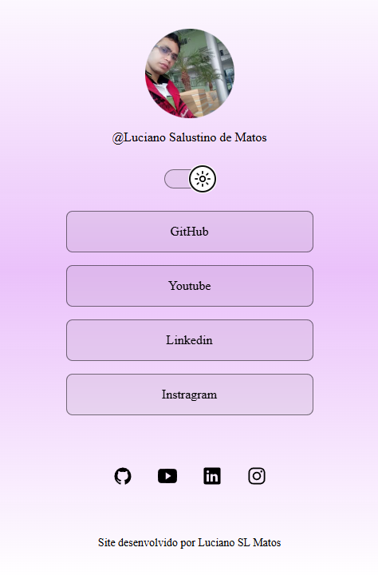

<h1 align="center"> portfólio </h1>

portfólio desenvolvido por Luciano Salustiano de Matos

  <a href="#-tecnologias">Tecnologias</a>&nbsp;&nbsp;&nbsp;|&nbsp;&nbsp;&nbsp;
  <a href="#-projeto">Projeto</a>&nbsp;&nbsp;&nbsp;|&nbsp;&nbsp;&nbsp;
  <a href="#-layout">Layout</a>&nbsp;&nbsp;&nbsp;|&nbsp;&nbsp;&nbsp;
  <a href="#memo-licença">Licença</a>

  

 

  

## 🚀 Tecnologias

Esse projeto foi desenvolvido com as seguintes tecnologias:

- HTML e CSS
- JavaScript
- Git e Github
- Figma

## 💻 Projeto

portfólio mostra um pouco dos meus conhecimento da tecnologia

<!-- ## 🔖 Layout

Você pode visualizar o layout do projeto através [DESSE LINK]
(https://www.figma.com/file/MF894TdzM9Fg9Ssu4KyMq/DevLinks-(Copy)?node-id=1%3A113&t=8x94o7ecTaQMC2CS-1/duplicate). É necessário ter conta no [Figma](https://figma.com) para acessá-lo. -->

## :memo: Licença

Esse projeto está sob a licença MIT.

